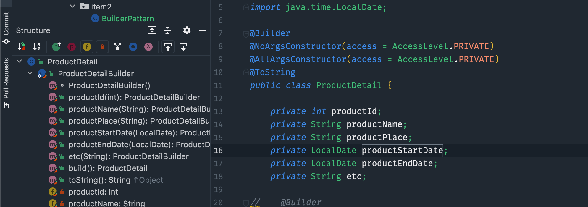
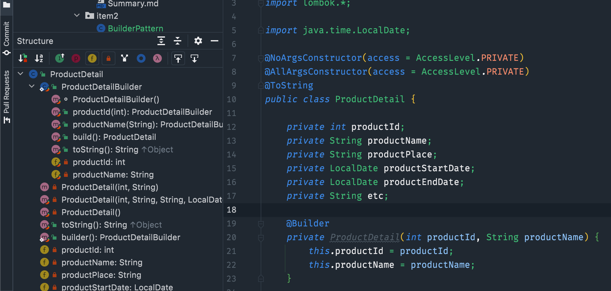

# 빌더를 고려하라

## 요약
1. build 메서드가 호출하는 생성자에서 여러 매개변수에 걸친 불변식을 검사하자
   1. 불변식 : 프로그램이 실행되는 동안, 혹은 정해진 기간동안 반드시 만족해야하는 조건, 변경이 허용은 되나, 주어진 조건안에서만
      1. ex) 리스트 크기는 반드시 0이상
2. 계층적으로 설계된 클래스와 함께 쓰기 좋음
3. 매개 변수가 4개 이상은 되어야 값어치를 함
4. 생성자, 정적팩터리 방식으로 시작했다가 나중에 매개변수가 많아지면, 빌더 패턴으로 전환할 수 있지만, 이전에 만들어둔 생성자와 정적팩터리가 도드라져 보일 것, 그러니 애초에 빌더로 시작하는 편이 낫다

## Question
1. Lombok builder 패턴시, 지정된 파라메터만 빌더로 만들기
2. 일반적으로 클래스 상단에 적어, 모든 변수들이 노출됨
3. 지정된 변수만 노출되도록 개발하고 싶어 테스트
### 1. 기본 클래스 상단에 @Builder 선언 시

### 2. 커스텀하게 만든 생성자 상단에 @Builder 선언 시

