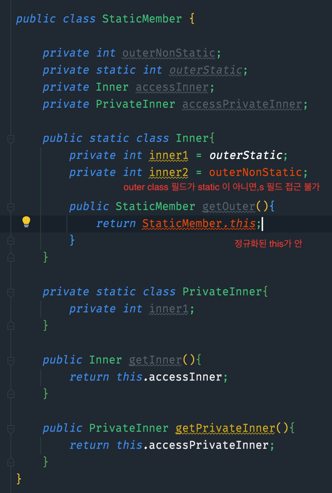
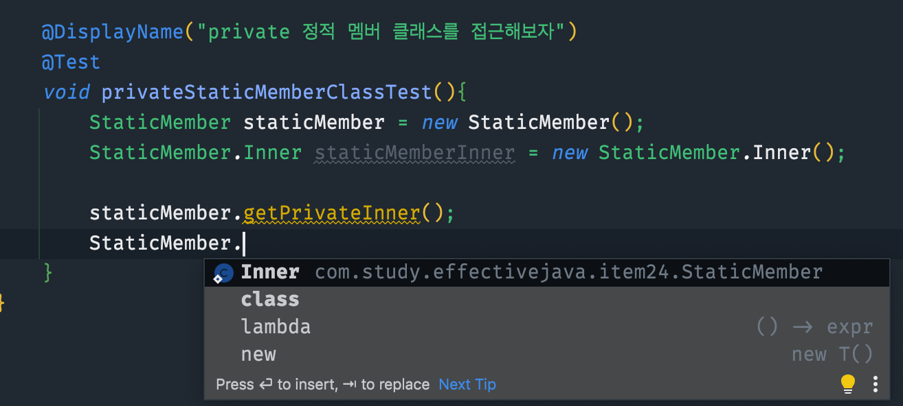
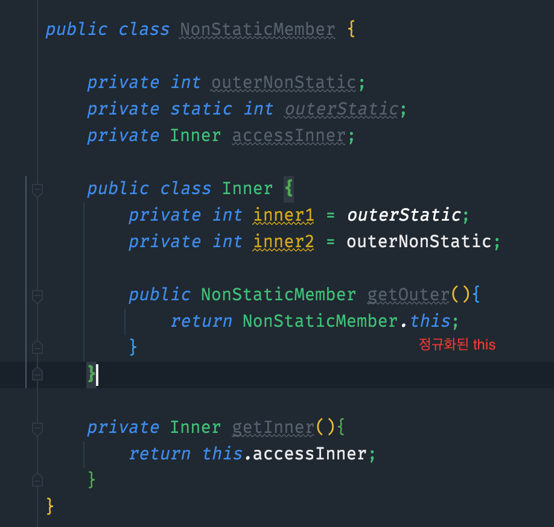
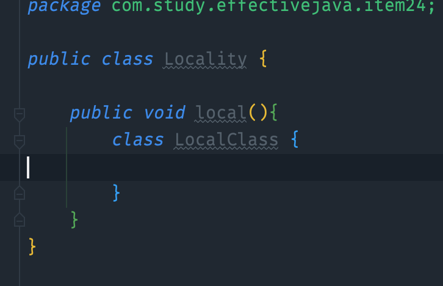

# 멤버 클래스는 되도록 static으로 만들라
- 멤버 클래스에서 바깥 인스턴스에 접근할 일이 없다면 무조건 static을 붙여서 정적 멤버 클래스로 만들자

### 1. 정적 멤버 클래스
- 다른 클래스 안에 선언되고, 바깥 클래스의 private 멤버에도 접근할 수 있다는 점만 제외하고는 일반 클래스와 동일
- private으로 선언하면 바깥 클래스에서만 접근 할 수 있다
- 중첩 클래스의 인스턴스가 바깥 인스턴스와 독립적으로 존재할 수 있다면 정적멤버클래스로 만들 것
- private 정적 멤버 클래스는 흔희 바깥 클래스가 표현하는 객체의 한 부분을 나타낼 때 쓴다.
- Map 엔트리 메서드 예시
  - 테스트 코드 쪽에, 구현체 부분들 확인해보니, 조금씩 다르게 구현되어 있음
    - ex) HashMap non static, TreeMap static...
- 정적 멤버 클래스 예제
- 

- private 정적 멤버 클래스 예제
- 

### 2. (비정적) 멤버 클래스 (내부 클래스에 해당)
- 암묵적으로 바깥 클래스와 연결된다. (숨은 외부참조를 갖게 됨)
  - 바깥 클래스를 가비지 컬렉터가 수거하지 못할 수 있음 (메모리 누수)
- 멤버 클래스의 인스턴스화 될 때 확립, 더 이상 변경 불가
- (Outerclass.new InnerClass(args))
- 어댑터를 정의할 때 자주 쓰임
  - 즉, 어떤 클래스의 인스턴스를 감싸 마치 다른 클래스의 인스턴스처럼 보이게 하는 뷰로 사용.
  - ex) Map의 keySet, EntrySet, values등

- 비정적 멤버 클래스 예제
- 

### 3. 익명 클래스 (내부 클래스에 해당)
- 선언과 동시에 인스턴스가 만들어짐
- 오직 비정적인 문맥에서 사용될 때만 바깥 클래스의 인스턴스를 참조할 수 있다
- 정적문맥에서라도 상수 변수 이외의 정적 멤버는 가질 수 없다.
  - 초기화된 final, 문자열 필드만 가능
- 익명 클래스가 상위 타입에서 상속한 멤버 외에는 호출불가
- 길면 가동성 떨어짐
- 익명 클래스의 또 다른 주 쓰임은 정적 팩터리 메서드를 구현할 때다. (intArrayAsList)

### 4. 지역 클래스 (내부 클래스에 해당)
- 지역변수를 선언할 수 있는 곳이면 어디서든 선언가능
- 유효 범위도 지역변수와 같다
- 메서드 안에 선언된 클래스 
- `void validate() {
  class MemberValidator {
  ...
  }
}`
- 지역 클래스 예제
- 
