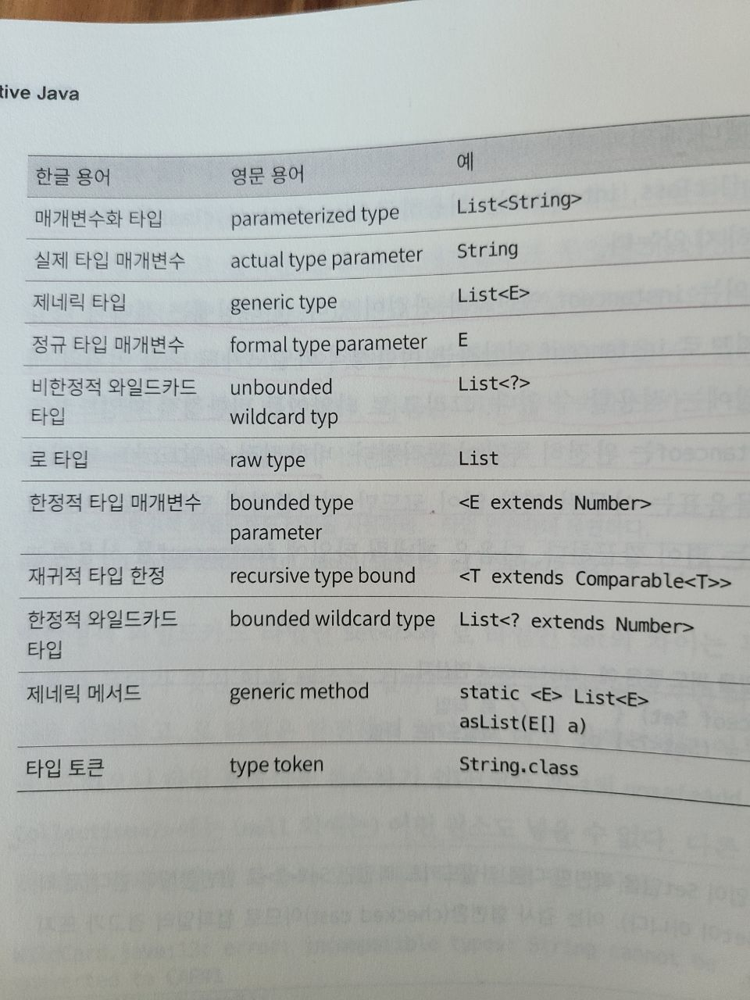

# 로 타입은 사용하지 말라
- 

### 제네릭과 로타입
- 제네릭 클래스 제네릭 인터페이스
  - 클래스와 인터페이스 선언에 타입 매개변수가 쓰인 것
  - ex) List<String> : 매개변수화 타입

- 로 타입이란 제네릭 타입에서 타입 매개변수를 전혀 사용하지 않을 때
  - ex) List
  - **로 타입은 제네릭 도입전 코드와 호환성을 위해 만들어진 '궁여지책'**
  - 로 타입으로 쓰면, 컴파일 단계에서 동일한 타입인지 확인을 못한다
  - 오류는 가능한 발생 즉시, 이상적으로는 컴파일 시, 발견되는 것이 좋다
  - 로 타입은 사용시, 다른 타입을 넣으면 런타임중에나 예외가 발생한다
  - 간혹 로 타입을 사용해서 문제가 되는 곳이 있다고 함
    - BigDecimal, BigInteger를 혼용해서 작성하다가 문제를 발생시킨 경우
  - **로 타입은 제네릭이 주는 안정성과 표현력 모두를 잃게한다**

### List vs List<Object>
- List는 제네릭 타입에서 완전히 발을 뺀 것, List<Object>는 모든 타입 허용
  - ex) List = List<String> 가능, List<Object> = List<String> 불가능
    - 제네릭의 하위 타입 규칙 때문
      - List<String>은 로 타입인 List의 하위 타입이지만, List<Object>의 하위 타입이 아니다
  - List<Object> 같은 매개변수화 타입을 사용할 때와 달리, List같은 로 타입을 사용하면 타입 안정성을 잃게 된다

### Set vs Set<?> (비한정적 와일드카드 타입)
- 제네릭을 쓰고 싶지만 실제 타입 매개변수가 무엇인지 신경 쓰고 싶지 않다면 물음표<?>를 사용하자
- 와일드카드 타입은 안전하고, 로 타입은 안전하지 않다
- 로 타입 컬렉션에는 아무 원소나 넣을 수 있어 타입 불변식을 훼손한다
- Collection<?> 같은 비한정적 와일드카드 타입에는 어떤 원소(null 외에는)도 넣을 수 없다. 다른 원소를 넣으면 컴파일 에러가 발생한다
  - 읽기는 가능

### 로 타입을 쓰지 말라는 규칙의 예외 케이스
- class 리터럴 
  - ex) List.class, String[].class, int.class 
  - 이 때에는 오히려, List<String>.class, List<?>.class 등을 허용하지 않는다
- instanceof
  - 비한정적 와일드카드 타입 이외의 매개변수화 타입에는 적용 불가능
    - **이 때, 비한정적 와일드카드는 코드만 지저분해지므로, 차라리 로 타입을 사용해라**
    - ex) `if(o instanceof Set) {
        Set<?> s = (Set<?>) o; }`

### Set<?> vs Set<Object>
- Set<Object> 
  - 어떤 타입의 객체도 저장할 수 있는 매개변수화 타입
- Set<?>
  - 모종의 타입 객체만 저장할 수 있는 와일드카드 타입
- Set 로타입은 제네릭 시스템에 속하지 않는다

### Question
1. 제네릭 하위 타입 규칙
- 단순히, 제네릭의 타입매개변수가 상위 클래스인 경우, 하위 타입의 제네릭 타입매개변수를 가진 클래스를 할당 가능하다

2. 비한정적 와일드카드 타입의 쓰임새 (ChatGPT)
   1. 제네릭 메서드의 매개변수 타입으로 사용 
      - 제네릭 메서드는 매개변수로 전달되는 타입이 제한되지 않을 경우 비한정적 와일드카드 타입을 사용할 수 있습니다. 이 경우, 메서드 내에서는 해당 타입을 사용할 수 없지만, 매개변수로 전달된 객체를 읽거나 필요에 따라 다른 타입으로 캐스팅하는 등의 작업은 가능합니다.

   2. 제네릭 클래스의 타입 매개변수로 사용
      - 비한정적 와일드카드 타입은 제네릭 클래스의 타입 매개변수로 사용할 때, 해당 클래스 내에서는 타입 안정성을 보장하면서도 다양한 타입의 객체를 받을 수 있도록 해줍니다.
      
   3. 제네릭 타입의 상한 경계로 사용 
      - 상한 경계(extends)를 사용하여 제네릭 타입의 타입 매개변수가 특정 클래스나 인터페이스의 하위 타입이 되도록 제한할 수 있습니다. 하지만, 어떤 클래스나 인터페이스를 상한 경계로 지정하지 않고 다양한 타입을 받을 수 있게 하려면 비한정적 와일드카드 타입을 사용할 수 있습니다.
      
   4. 제네릭 타입을 사용하는 컬렉션에서 요소 타입으로 사용
      - 컬렉션에서 요소 타입으로 비한정적 와일드카드 타입을 사용하면, 다양한 타입의 객체를 담을 수 있는 컬렉션을 만들 수 있습니다. 이렇게 만든 컬렉션은 읽기만 가능하며, 쓰기는 불가능합니다.