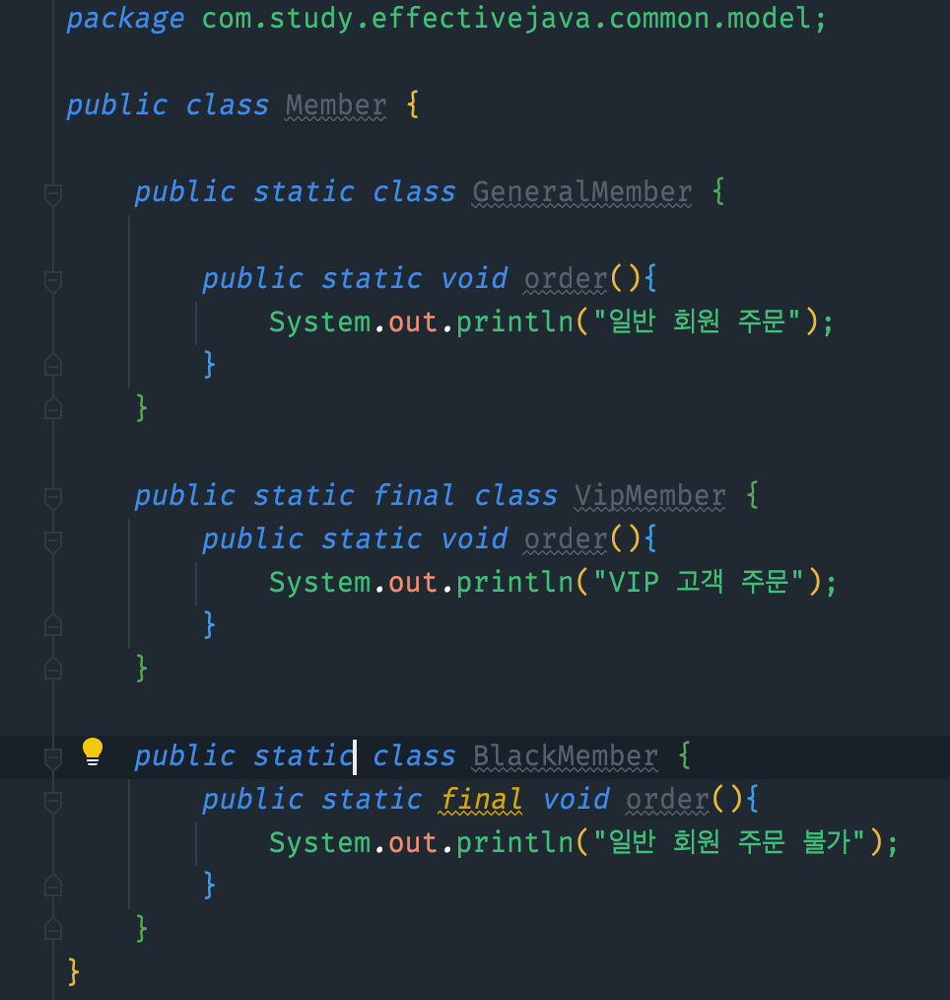
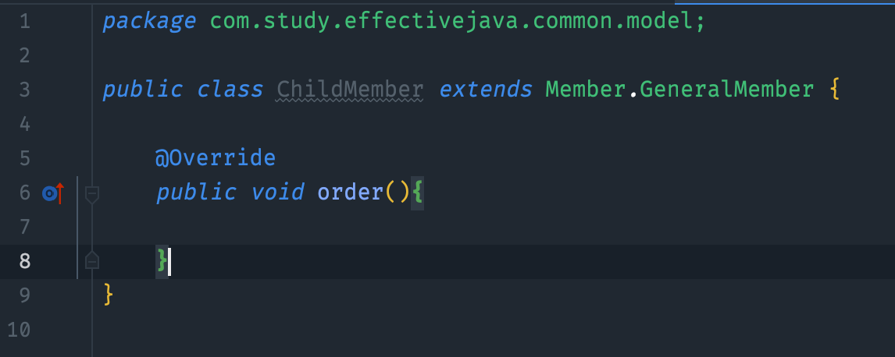
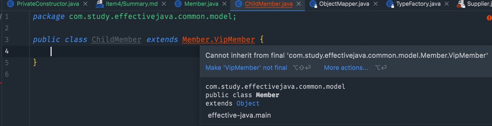
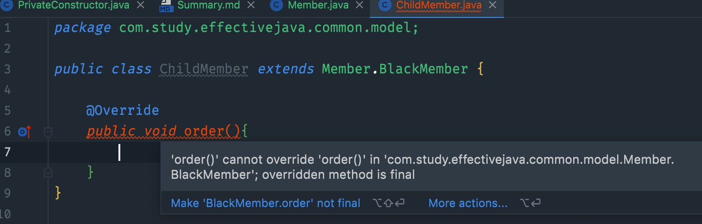
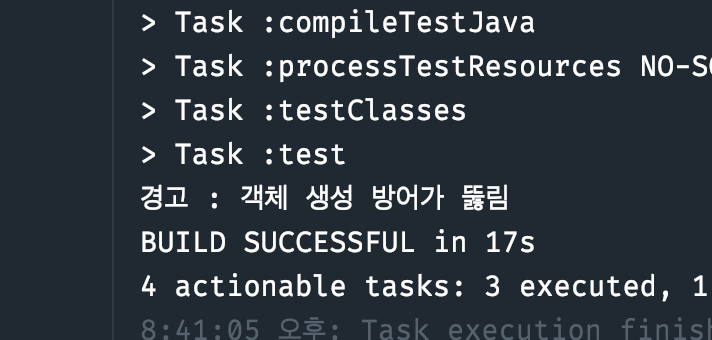
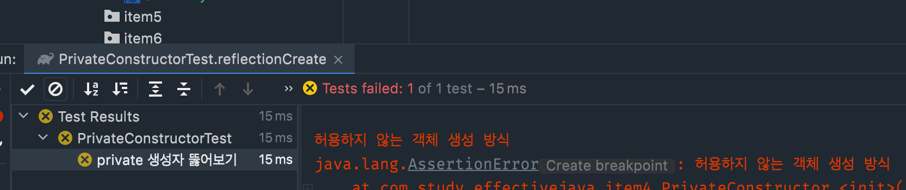

# 인스턴스화를 막으려거든 private 생성자를 사용하라 

## 요약
1. 정적 필드와 정적 메서드만 담은 클래스를 만들고 싶은 경우, 이는 객체 지향적 사고가 아니지만 나름의 쓰임새가 있음(남용은 금지)
   1. java.lang.Math, java.util.Array 처럼 관련 메서드들을 모아두거나
   2. java.util.Collections처럼 특정 인터페이스를 구현하는 객체를 생성해주는 정적 메서드를 모아놓을 수 있다
   3. final 클래스와 관련한 메서드들을 모아놓을 때도 있다 (상속해서 하위클래스에 메서드를 넣는건 불가능하기 때문)
2. 추상클래스로 만드는 것으로는 인스턴스화를 막을 수 없음
   1. private 생성자를 추가하면 클래스의 인스턴스화를 막을 수 있다
3. 이 방식은 상속을 불가능하게 하는 효과도 있다
   1. 모든 생성자는 상위 클래스의 생성자를 호출하게 되는데, 이를 private으로 선언했으니, 하위 클래스가 상위 클래스의 생성자에 접근할 길이 막힌다

## Question
1. public, final 클래스, 메서드 들을 구성해서 상속 및 override 테스트 해보기
### Member 클래스에, public class / public method / final class/ final method 등의 구성을 해둔다

### 1. public class , public method

### 2. public final class , public method

### 3. public class , public final method

2. Reflection으로는 뚫리지 않는가?
   1. PrivateConstructorTest코드에 작성
### 1. private 생성자만 있는 경우

### 2. private 생성자에 예외 throw 있는 경우

### 결론
- 확실히 하려면, private + throw Exception 처리를 해줘야 막힌다