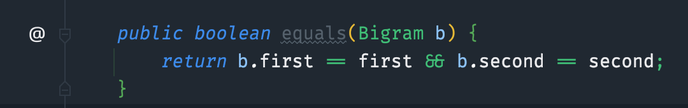
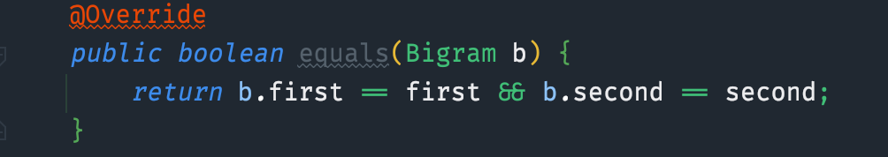
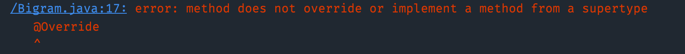

# @Override 애너테이션을 일관되게 사용하라
- 사용하지 않는 경우 인간적인 실수로 인해, 메서드 오버로딩이 될 수도 있음

- 예외적으로 사용가능한 경우는 1가지
  - 구체 클래스에서 상위 클래스의 추상메서드를 재정의한 경우엔 안달아도 된다. 어차피 구현하지 않은 추상메서드는 컴파일러가 잡아주기 때문

### 잘못된 equals 예제

- 1번 그림처럼 작성하면, 메서드 오버로딩이 되어, 오동작을 하게 된다. (HashSet add 예제 참고)
- 2번 처럼 @Override를 붙여주는 순간 IDE 레벨에서 잘못된 메서드 시그니처를 잡아준다
  - 물론 3번그림처럼, 컴파일에러도 발생한다

