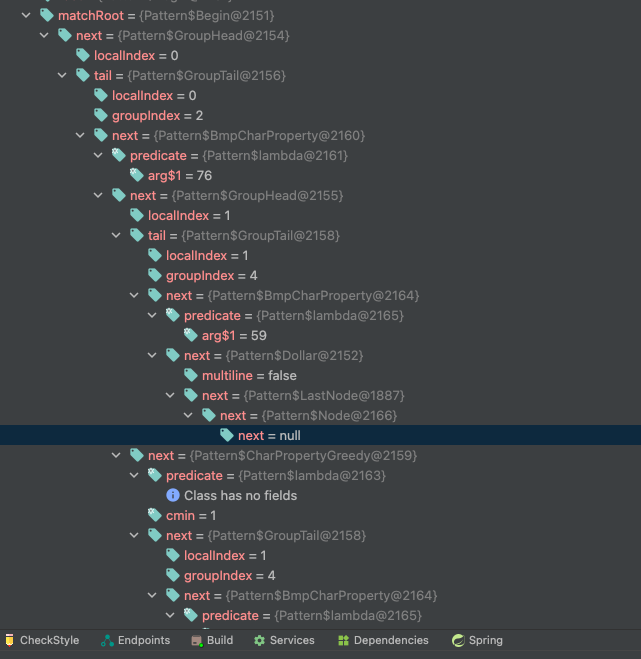
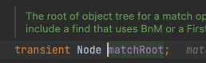
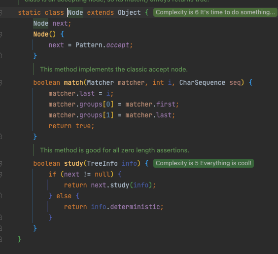

# 불필요한 객체 생성을 피하라

## 요약
1. 똑같은 기능의 객체를 매번 생성하기보다는 재사용하는 편이 낫다
2. 불변 클래스에서는 정적 팩터리 메서드를 사용해 불필요한 객체 생성을 피할 수 있다.
3. string.mathces의 자주 호출시 문제점 (AvoidNotNeededObjectTest 참고)
4. Map 인터페이스의 keySet은 호출 시, Set을 반환
   1. 매번 새로운 Set인스턴스인지, 같은 인스턴스를 반환할지?
   2. 가변이든, 불변이든, 반환한 객체 중 하나를 수정하면 다른 모든 객체가 변경된다.
      1. 이는 Map인스턴스를 대변하기 때문
         1. 따라서, Set(뷰 객체)를 여러 개 만들어도 상관은 없지만, 그럴 필요도 이득도 없다.
      2. 내부 코드 확인 시, 1회만 생성하도록 되어 있음 (openjdk 1.8 기준)
5. 불필요한 객체를 만드는 또 다른 예로, 오토 박싱이 있다
   1. 기본 타입과 그에 대응하는 박싱된 기본 타입의 구분을 흐려주지만, 완전히 없애주는 것은 아니다.
   2. 의미 상에는 별 다를 것 없지만, 성능상에서는 그렇지 않다
   3. 박싱된 기본타입 보다는 기본 타입을 사용하고, 의도치 않은 오토박싱이 숨어들지 않도록 주의하자.
      1. NOTE : 객체 생성은 비싸니 피해야 한다로 오해하면 안된다
      2. 요즘 JVM에서는 별다른 일을 하지 않은 작은 객체를 생성하고 회수하는 일이 크게 부담되지 않는다. 
      3. 명확성, 간결성, 기능을 위해서 객체를 추가로 생성하는 것은 일반적으로 좋은일이다.
      4. 거꾸로, 아주 무거운 객체가 아닌 다음에야, 객체 생성을 피하고자 여러분만의 객체풀을 만들지는 말자.
      5. 객체풀을 만드는 것이 나은 예는 DBConnection 이는 객체 생성 비용이 워낙 비싸기 때문
      6. 일반적으로 자체 객체 풀은 코드를 헷갈리게 만들고, 메모리 사용을 늘리고, 성능을 떨어트린다.
      7. 요즘 JVM 가비지 컬렉터는 상당히 잘 최적화되어서 가벼운 객체용을 다룰 때는 직접 만든 객체 풀보다 훨씬 빠르다

## Question
1. 객체 생성 비용이 비싸다라는 것은?
   1. 메모리 공간의 할당, 객체의 초기화, 메서드와 프로퍼티의 생성 등 여러 가지 작업을 수행하는 데에 많은 시간이 걸린다는 것
2. DB 커넥션 객체 생성은 왜 비쌀까?
   1. 네트워크 통신 측면
   2. 권한, 인증 정보 측면
   3. 자원 할당 측면 (메모리, CPU, 데이터베이스 커서 등)
   4. 클라와 서버 양측에서 전체적으로 비용이 비싸다는 것으로 생각 됨
3. "요즘 JVM 가비지 컬렉터는 상당히 잘 최적화되어서 가벼운 객체용을 다룰 때는 직접 만든 객체 풀보다 훨씬 빠르다" 라는 것의 의미는?
   1. 추측 : 객체 풀을 만들 때에는, create만 하지 않고, 사용되지 않거나, 특정 조건에 따라, remove를 호출해서 내부에서 제거 하는 경우도 있는데, 이럴 바에는, 차라리 생명주기를 GC에 맡기는 편이 빠르다라는 것으로 보임.
4. 3번 추측의 꼬리 질문으로 그렇다면, 기존 GC는 느렸었나?
   1. 추측 :
      1. 이펙티브 자바 초판이 2003년도다, 나무 위키로 JDK 버전별 연도를 봤을 때, 1.5버전이 2004년 9월 발표 되었으니, 책의 저자는 적어도 1.4 버전을 기준으로도 요즘 GC라 말을 했을 것이라 생각된다.
      2. JDK 1.4버전의 GC는 명확히 찾긴 어렵지만, 검색 중, 오라클 홈페이지가 나왔고, JAVA SE 5, 6에서는 default GC가 Serial GC라는 것을 찾았다. (다른 GC를 선택 가능한지는 안해봐서 모르겠다) (https://www.oracle.com/webfolder/technetwork/tutorials/obe/java/gc01/index.html)
      3. 이는, 1.4 이하 버전은 Serial GC가 기본 GC일수 있고, 더 낙후된 GC일수도 있다.
         1. 첨언 :SerialGC는 JDK 18에서도 지속적으로 개선되고 있다.(모든 GC들은 계속 개선을 시키는 것으로 보임)
      4. 정리하자면, 저자가 경험한 JDK에서는 많이 낙후된 우리가 모르는 GC 혹은 최적화 이전 Serial GC를 경험했을 것으로 판단된다.
      5. Serial GC의 내용을 추가하자면, 싱글 스레드로 동작하고, 객체의 갯수와 크기가 많아지면 많아질수록, 싱글스레드가 해야할 작업이 많아진다는 것을 의미한다. (각 객체의 사용 상황도 확인해봐야 할 것이므로...)
         1. 이는, 무분별하게 새로운 생성자를 많이 생성하면 생성할 수록, GC 동작시간은 점점 느려진다.
         2. 그러므로, 사용자가 해당 GC를 사용하는 경우, 직접 pool을 생성하여, 객체 수나, 생성 및 GC 대상으로 만드는 시점을(객체 = null 등으로) 직접 관리하는 편이 빠르지 않았을까 추론해본다.

5. Pattern 객체의 인스턴스 비용?
### 1. 내부 스터디에서 이슈로 나와 분석해본다.

- 이미 주석에도 노드로 구성된다는 언급이 있다
- 코드를 디버깅하며 따라가다보면, 입력된 정규표현식을 분석해, 인스턴스화하는 것을 볼 수 있다. 디버깅 내용은 아래 이미지와 같다.  

- 디버깅하는 해당 matchRoot라는 변수를 보면, Node 타입의 객체이고, Node 타입 객체들은 다음과 같은 구성을 한다

  

- 결국 정규표현식을 사용하면, 내부 표현식 상태에 따라, 노드 객체가 인스턴스화 되고, 정규표현식의 표현 구분에 따라, 그 노드 깊이는 깊어진다  
- 깊어지는만큼 인스턴스화 되는 객체가 많고, GC 갯수가 많아진다.