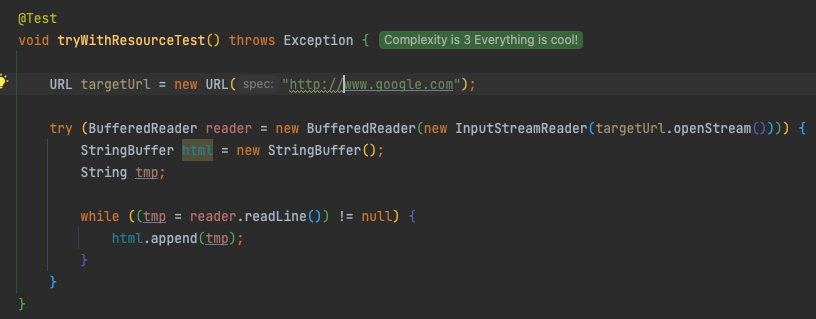
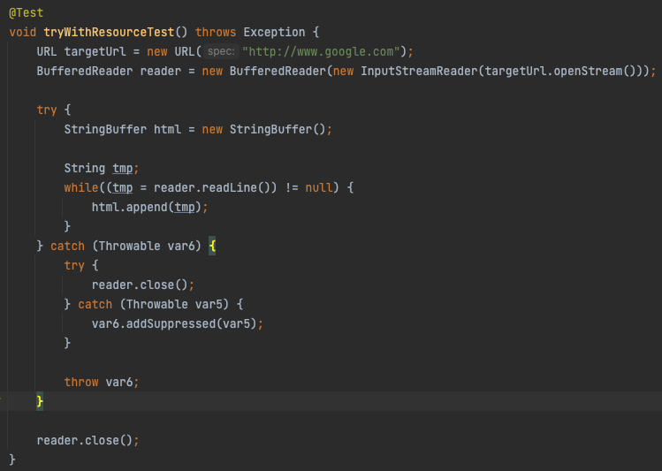

# try-finally보다는 try-with-resources를 사용하라

## 요약
1. try-finally는 실수를 유발하고, 중첩해서 사용하는 경우, 두번째 예외가 첫번째 예외를 집어 삼킨다
   1. 물론 첫번째 예외를 출력할 수 있지만 코드가 복잡해진다.
2. try-with-resources는 숨겨진 예외들도 그냥 버려지지 않고, 스택 추적 내역에 '숨겨졌다(suppressed)'는 꼬리표를 달고 출력된다.
   1. 또한, JAVA7에서 Throwable에 추가된 getSuppressed메서드를 이용하면 프로그램 코드에서 가져올 수 있다.

## Question
1. 클래스코드나 디컴파일코드에선 어떻게 표현되고 있을까?

- try with resource 구문 테스트 코드다.
- 해당 코드를 실행해 클래스 코드를 보면 다음과 같다. 

- 결국엔, try catch 구문으로 된다. 단순히 가독성만 높여주는 듯하고, 개발자가 직접 관리하는 경우 발생하는 실수를 줄여주는 것 같다
- 내부적으론 특별할 것이 없었다.
